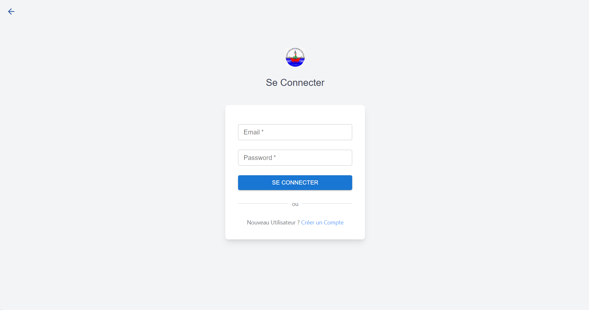
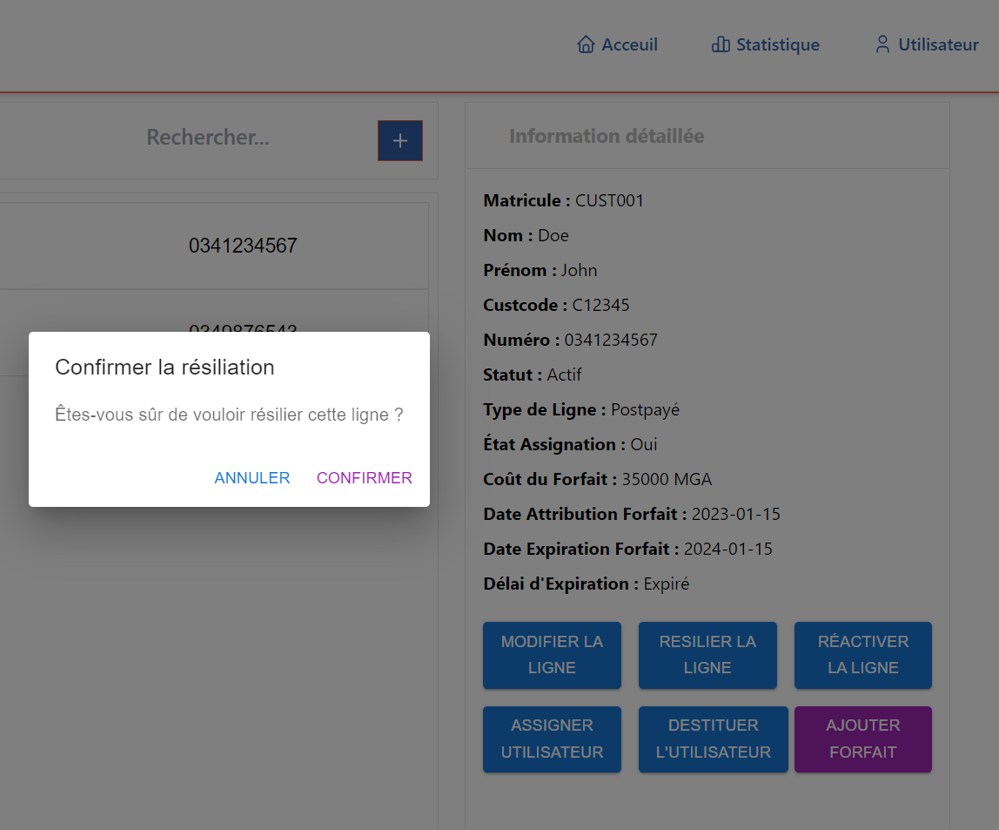

# 📇 Gestion des Contacts Professionnels – APMF

## 📖 Overview

Application web de gestion des contacts professionnels développée lors d’un stage à l’APMF.

La plateforme permet de centraliser et gérer efficacement les contacts professionnels à travers une interface moderne, responsive et sécurisée.

---

# 🚀 Features

## 👥 Contact Management
- Ajout de contacts professionnels
- Modification et suppression des contacts
- Recherche et gestion des informations
- Interface utilisateur responsive

## 🔐 Authentication
- Authentification simple
- Gestion sécurisée des accès

## 📤 Export Features
- Exportation des contacts en fichier XLS
- Gestion simplifiée des données

## 🌐 API
- API REST pour les opérations CRUD
- Communication frontend/backend optimisée

---

# 🧰 Tech Stack

| Layer | Technologies |
|-------|---------------|
| Frontend | React.js, TailwindCSS |
| Backend | Express.js, Node.js |
| Database | PostgreSQL |

---

# 🔗 Architecture

```text
Frontend (React.js) → API Express.js → PostgreSQL
```

---

# 📦 Installation

## 🔧 Backend

```bash
cd backend
```

### Install dependencies

```bash
npm install
```

### Configure environment variables

```bash
cp .env.example .env
```

### Run backend server

```bash
node index.js
```

---

## 💻 Frontend

```bash
cd frontend
```

### Install dependencies

```bash
npm install
```

### Run frontend server

```bash
npm run dev
```

---

# ⚙️ Environment Variables

```env
PORT=3000
DB_HOST=localhost
DB_USER=your_user
DB_PASSWORD=your_password
DB_NAME=contacts_db
```

---

# 📸 Application Preview

<div align="center">

## 🔐 Login Page


<br><br>

## 📝 Sign Up


<br><br>

## 🏠 Application Home


<br><br>

## 📊 Dashboard


<br><br>

## 🔢 Assign Number


<br><br>

## 🔑 Key Security


<br><br>

## 🚪 Resignation Page


</div>

---

# 📁 Project Structure

```bash
gestion-contacts-apmf/
│
├── backend/
│   ├── routes/
│   ├── controllers/
│   ├── config/
│   └── ...
│
├── frontend/
│   ├── src/
│   ├── components/
│   └── ...
│
└── README.md
```
